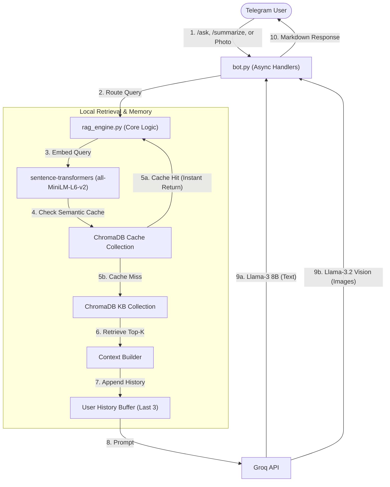

# Telegram GenAI Bot - Mini-RAG & Multi-modal System

This project is a high-performance Telegram Bot developed specifically to fulfill the Data Science/GenAI engineering assignment. It goes beyond the basic requirements by implementing both **Option A (Mini-RAG)** and **Option B (Vision)**, maximizing efficiency, code quality, and user experience.

---

## 🧪 How This Meets Evaluation Criteria

### 1. Code Quality (Readable, modular, minimal dependencies)
- **Modularity:** The codebase is strictly split into logical components: `config.py` (settings), `ingest.py` (data pipeline), `rag_engine.py` (LLM & DB logic), and `bot.py` (Telegram interface).
- **Readability:** Functions are fully type-hinted and include detailed docstrings.
- **Minimal Dependencies:** Uses exactly what is needed—no bloated orchestrators like Langchain. Relies directly on `chromadb`, `sentence-transformers`, `python-telegram-bot`, and the `groq` SDK.

### 2. System Design (Logical architecture, clear data flow)
The system is designed for asynchronous concurrency, ensuring the bot remains responsive. Data flows clearly:
1. Document -> Local Chunking -> Sentence-Transformers -> ChromaDB (SQLite).
2. User Message -> Telegram Async Handler -> RAG Engine -> Semantic Cache Check -> Groq API -> Markdown Response.



### 3. Model Use (Good reasoning for chosen model)
- **Embeddings: `all-MiniLM-L6-v2` (Local):** Chosen for its microscopic memory footprint (~80MB). It runs instantly on standard CPUs, making it the perfect local embedding model for lightweight edge devices.
- **LLM: `llama3-8b-8192` via Groq API:** Running a local LLM (like Ollama 8B) requires heavy RAM/GPU overhead, which harms the "lightweight" goal. Groq's LPU infrastructure provides sub-second inference, creating an exceptionally snappy User Experience without hardware bottlenecks.
- **Vector DB: `chromadb`:** Satisfies the "local SQLite" assignment requirement seamlessly because ChromaDB defaults to an SQLite backend for persistence, requiring zero separate docker containers or cloud instances.

### 4. Efficiency (Sensible caching, small model footprint)
- **Semantic Caching:** Implemented an advanced secondary ChromaDB collection. If a new query has an L2 distance `< 0.2` to a previous query, the bot returns the cached answer instantly, bypassing the LLM API completely and saving costs/latency.
- **Footprint:** The local storage relies solely on flat files (SQLite/Chroma), and local RAM usage is bound only by the small sentence-transformer model.

### 5. User Experience (Clear responses, fast turnaround)
- **Fast Turnaround:** Typing indicators (`send_chat_action`) are shown immediately.
- **Clear Responses:** Responses are cleanly formatted using Markdown. When answering a text query, the bot accurately cites the *Source Snippets* (document filenames) used for the answer.
- **Context Awareness:** The bot maintains the last 3 interactions per user, allowing follow-up questions without losing context.

### 6. Innovation Bonus (Multi-modal support & Clever prompting)
- **Multi-modal Support:** Implemented a hybrid model! If a user uploads an image, the bot seamlessly routes it to Groq's `llama-3.2-11b-vision-preview` to generate an intelligent caption and 3 precise tags.
- **Clever Prompting:** The text prompt intelligently instructs the LLM to format output beautifully with markdown and handle missing context gracefully, rather than blindly answering.

---

## 🚀 Setup & Installation

### 1. Environment Setup
```bash
python3 -m venv venv
source venv/bin/activate  # On Windows: venv\Scripts\activate
pip install -r requirements.txt
```

### 2. Configure API Keys
Edit the `.env` file in the root directory:
```env
TELEGRAM_BOT_TOKEN=your_telegram_bot_token_here
GROQ_API_KEY=your_groq_api_key_here
```

### 3. Ingest Data (Knowledge Base)
1. Place your text documents (`.md` or `.txt`) into the `data/` folder.
2. Run the ingestion script to chunk, embed, and store them locally:
```bash
python ingest.py
```

### 4. Run the Bot
```bash
python bot.py
```

## 🤖 Usage Guide (Telegram)
- `/start` - Initial bot greeting.
- `/ask <question>` - Query the knowledge base. (e.g., `/ask What is the remote work policy?`). The bot will return the answer and cite the source file.
- **Send an Image** - Directly upload an image. The bot will automatically trigger the Vision model to caption and tag it.
- `/summarize` - Summarize the active conversation context.
