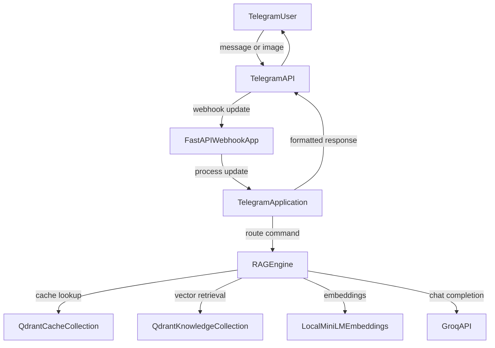
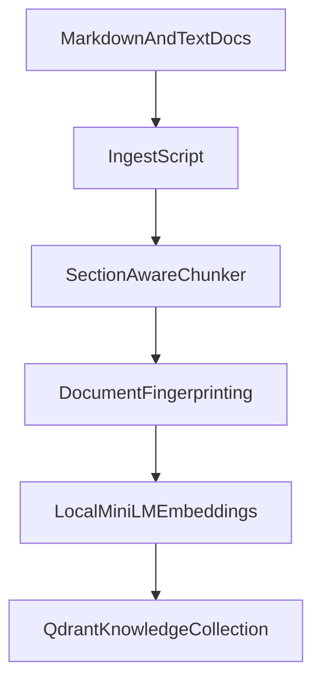

# Telegram RAG Bot

A deployment-oriented Telegram bot that combines:

- document question answering with RAG
- semantic caching
- conversational memory
- image description using Groq vision models
- FastAPI webhook support for container deployment
- local semantic embeddings with `all-MiniLM-L6-v2`

This repository started as an assignment submission and has been upgraded toward a production-ready architecture.

## Architecture

### Query serving flow



### Ingestion flow



## Project structure

- `bot.py`: Telegram command handlers and application factory
- `app.py`: FastAPI webhook app with health and readiness endpoints
- `api/index.py`: legacy Vercel entrypoint
- `rag_engine.py`: retrieval, prompting, memory, and Groq integration
- `vector_store.py`: Qdrant vector abstraction for knowledge base and semantic cache
- `ingest.py`: chunking, fingerprint-aware indexing, and upserts
- `scripts/evaluate.py`: benchmark-style demo script
- `scripts/set_webhook.py`: Telegram webhook registration helper
- `tests/`: lightweight validation tests

## Why these model choices

- Text LLM: `llama-3.1-8b-instant` on Groq for low-latency inference
- Vision LLM: `llama-3.2-11b-vision-preview` on Groq for image captioning
- Embeddings: `sentence-transformers/all-MiniLM-L6-v2` for strong local semantic retrieval
- Vector store: Qdrant Cloud for deployable persistence with local dev fallback

## Environment variables

Create a `.env` file with at least:

```env
APP_ENV=development
DEPLOYMENT_MODE=polling
LOG_LEVEL=INFO

TELEGRAM_BOT_TOKEN=your_telegram_bot_token
GROQ_API_KEY=your_groq_api_key

TELEGRAM_WEBHOOK_BASE_URL=https://your-app.fly.dev
TELEGRAM_WEBHOOK_PATH=/telegram/webhook
TELEGRAM_WEBHOOK_SECRET=your_random_secret
AUTO_SET_WEBHOOK=false

QDRANT_URL=https://your-qdrant-instance
QDRANT_API_KEY=your_qdrant_api_key
QDRANT_LOCAL_PATH=db/qdrant
```

Notes:

- local development can use `DEPLOYMENT_MODE=polling`
- production should use `DEPLOYMENT_MODE=webhook`
- production also requires `QDRANT_URL`
- local embeddings remove hosted embedding API quotas from the runtime path
- if `QDRANT_URL` is omitted, local embedded Qdrant storage is used

## Local development

### 1. Install dependencies

```bash
python3 -m venv venv
source venv/bin/activate
pip install -r requirements.txt
```

### 2. Add knowledge-base data

Place `.md` or `.txt` files in the `data/` directory.

### 3. Index documents

```bash
python ingest.py
```

### 4. Run locally with polling

Set `DEPLOYMENT_MODE=polling` and run:

```bash
python bot.py
```

## Webhook mode

Set:

```env
DEPLOYMENT_MODE=webhook
TELEGRAM_WEBHOOK_BASE_URL=https://your-domain.vercel.app
TELEGRAM_WEBHOOK_SECRET=your_random_secret
```

Run locally or in a container:

```bash
uvicorn app:app --host 0.0.0.0 --port 8000
```

Register the webhook:

```bash
python scripts/set_webhook.py
```

## Docker

Build and run:

```bash
docker-compose up --build
```

The app is exposed on `http://localhost:8000`.

## Fly.io deployment

This repository includes a `fly.toml` template for container deployment on Fly.io.

Typical deployment flow:

1. Install the Fly CLI and authenticate
2. Create your app with `fly launch --copy-config`
3. Set secrets like `TELEGRAM_BOT_TOKEN`, `GROQ_API_KEY`, `QDRANT_URL`, and `QDRANT_API_KEY`
4. Deploy with `fly deploy`
5. Run `python scripts/set_webhook.py` with `TELEGRAM_WEBHOOK_BASE_URL` set to your Fly domain

## Health endpoints

- `GET /health`: shallow liveness check
- `GET /ready`: readiness check including RAG/vector-store status

## Evaluation and testing

Run the lightweight tests:

```bash
pytest
```

Run the benchmark/demo script:

```bash
python scripts/evaluate.py
```

The evaluation script prints sample query results, grounding state, sources, and answer previews.

## Demo prompts

Useful Telegram prompts for demos:

- `/start`
- `/help`
- `/ask What are path parameters in FastAPI?`
- `/ask How do I declare query parameters?`
- `/ask When should I use async def in FastAPI?`

You can also upload an image to trigger the vision pipeline.

## Engineering tradeoffs

- Qdrant was chosen because local disk-backed vector storage is not suitable for production deployment.
- Fly.io is a better fit than Vercel for local `sentence-transformers` inference.
- The FastAPI webhook path is more deployment-friendly than Telegram polling.
- Local polling is still kept for quick development loops.
- Local embeddings avoid hosted embedding API quotas and keep retrieval quality strong.
